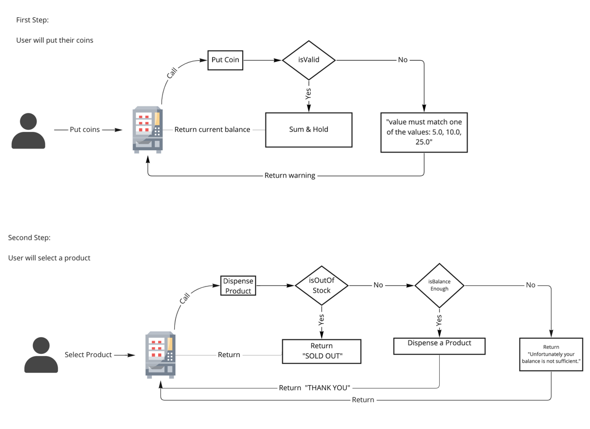

## Vending Machine Application

##### This app has been developed as Restful APIs with Spring Boot 

Aim of Vending Machine Applicaiton is to dispense product to the customers who selected.

### Contents 

- [Welcome](#welcome)
- [Application Flow](#application-flow-process)
- [Application Tech Stack](#application-tech-stack)
- [Docker Build and Run](#docker-build-and-run)
- [Api Endpoints](#api-endpoints)
  - [Put Coin](#put-coin)
  - [Dispense Product](#dispense-product)
  - [Api Doc](#api-doc)
- [Initial Data Load to Tables](#initial-data-load-to-tables)

### Welcome

Welcome on vending-machine board

You will be find details about project bellow.

App will run on 8090 port.

When you are running to started this app on your pc;
data.sql will create ***product*** table

Initially, some example data will be created on tables.

### Application Flow

The application flow simply as follows:

### Application Tech Stack

The application developed with 
- **java 17**
- **Springboot**
- **H2 database**
- **spring-boot-data-jpa**
- **Lombok**
- **spring-boot-starter-validation**
- **spring-boot-starter-test, mockito and junit5**
- **springdoc-openapi-ui** 

***Version 2.7.0 was used for all dependencies related to spring!***

### Docker build and run

`docker build --tag=vending-machine:1.0 .`

`docker run -p 8090:8090 vending-machine:1.0 .`

### Api Endpoints

Postman collection is here 
[vending-machine.postman_collection.json](https://github.com/atesibrahim/vending-machine/blob/master/src/main/resources/vending-machine.postman_collection.json)

You will be found postman collection under `resource/postman-collection`

#### Put Coin

POST: http://localhost:8090/coins

Body should be like;
`{
"insertedCoin":25
}`

In case of successful your response will be like;

`your current balance is $0.2`

When your coin is not valid one, then you will be get error like;

`{
"violations": [
{
"fieldName": "insertedCoin",
"message": "value must match one of the values: 5.0, 10.0, 25.0"
}
]
}`

#### Dispense Product

POST: http://localhost:8090/products

Body should be like;
{
"id":1
}

In case of successful your response body will be like;

`{
"responseMessage": "THANK YOU",
"productName": "COLA",
"currentBalance": 1.0
}`

When you request product, if there is no stock then you will be get error like;

`{
"responseMessage": "SOLD OUT",
"currentBalance": 1.0,
"productName": "null
}`

When you request product, if your balance is not enough then you will be get error like;

`{
"responseMessage": "Unfortunately your balance is not sufficient.",
"currentBalance": 0.2,
"productName": null
}`

### API Doc

Api Doc(Swagger) will be served on following endpoint;

GET : `http://localhost:8090/`

### Initial Data Load to Tables

Following data added to data.sql file under resource folder. These data is added initially when the application run.

`INSERT INTO product (id, name, price, stock) VALUES (1, 'COLA', 1.0, 5);`

`INSERT INTO product (id, name, price, stock) VALUES (2, 'CHIPS', 0.50, 10);`

`INSERT INTO product (id, name, price, stock) VALUES (3, 'CANDY', 0.65, 20);`
